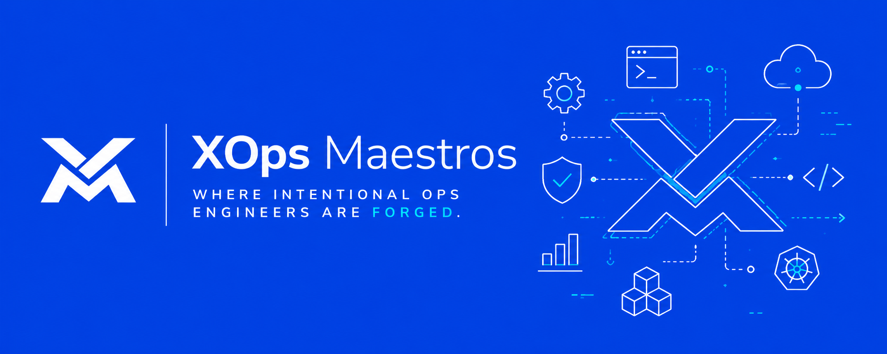

# Xops Maestros

"Where intentional ops engineers are forged".

Xops Maestros is a challenge-driven learning and career platform for Ops engineers (DevOps, Platform, SRE, DevSecOps, Cloud, MLOps, etcetera).

We bridge the gap between theory and operational mastery through real-world scenarios, production-grade projects, mentorship, and community collaboration.

## Get On Board

If you fall into any of the below categories, then we're building for you. 

- **Talents and engineers** seeking intentional ops career growth through real-world practice, mentorship, and production-grade challenges.

- **Ops leaders** ready to mentor, review, and guide the next generation of operationally excellent engineers.

- **Recruiters** seeking highly vetted, interview-proven ops talent for serious infrastructure, platform, cloud, reliability, security, and MLOps roles.
