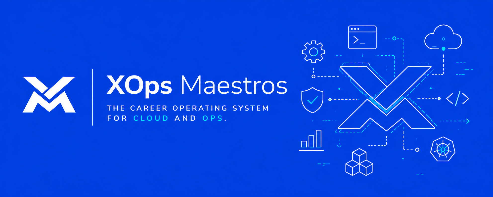

# XOps Maestros(x-ops-mai·strowz)

XOps Maestros is the professional network for Cloud and Ops(DevOps, Platform, SRE, DevSecOps, Cloud, MLOps, AIOps, etcetera) - built around verifiable expertise and proof-of-work.

We are building the career operating system for Cloud and Ops - the one platform with everything needed to build a fulfilling career in Cloud and Ops. From professional networking to talent development, to jobs/hiring, and more.

## Get On Board

If you fall into any of the below categories, then we're building for you.

- **Talents and engineers** seeking intentional ops career growth through real-world practice, mentorship, and production-grade challenges.

- **Ops leaders** ready to mentor and guide the next generation of operationally excellent engineers.

- **Recruiters** seeking highly vetted, interview-proven ops talent for serious infrastructure, platform, cloud, reliability, security, and MLOps roles.

👉🏻: [https://app.xopsmaestros.com/](https://app.xopsmaestros.com/)